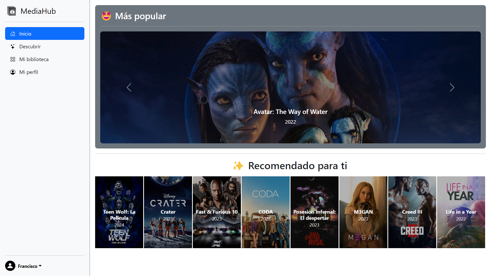
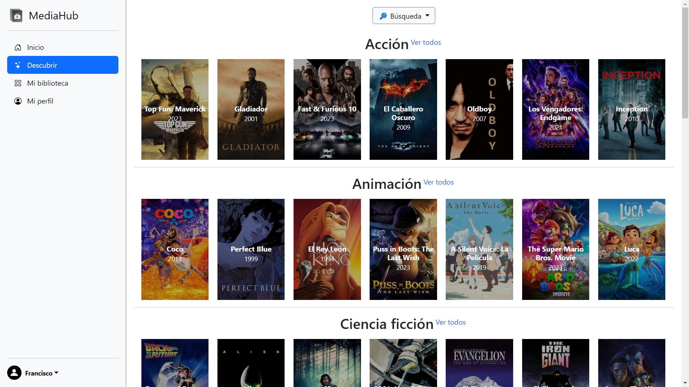
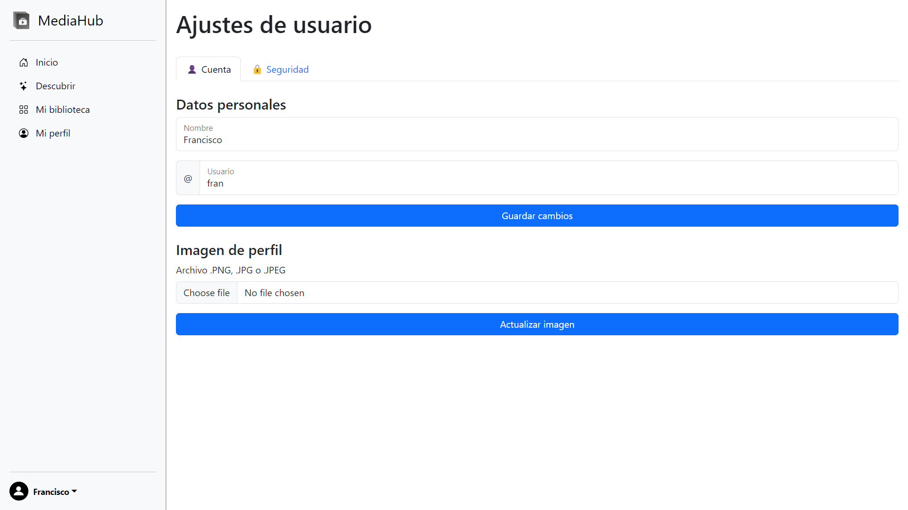

<a href="./README.md">English</a> - <b>Español</b>

> **Repositorio archivado**
> 
> Aunque puede que ya no se mantenga o actualice de forma activa, te invito a explorar el código y la documentación, ya que reflejan la pasión y el esfuerzo que vertí en este proyecto. Aunque algunos aspectos pueden haber quedado obsoletos, espero que este archivo sirva como testimonio de mi crecimiento como desarrollador. Gracias por tomarte el tiempo de explorar este repositorio y por formar parte de mi viaje.
>
>Desarrollé este proyecto en 2023, como proyecto final de mi Grado Superior de Formación Profesional en Desarrollo Web. Es un *rework* de un proyecto anterior, [mediahub-spring](https://github.com/fmpavon/mediahub-spring), pero esta vez realizado en PHP puro y con varias mejoras (mejor UI, recomendaciones de usuario...).

